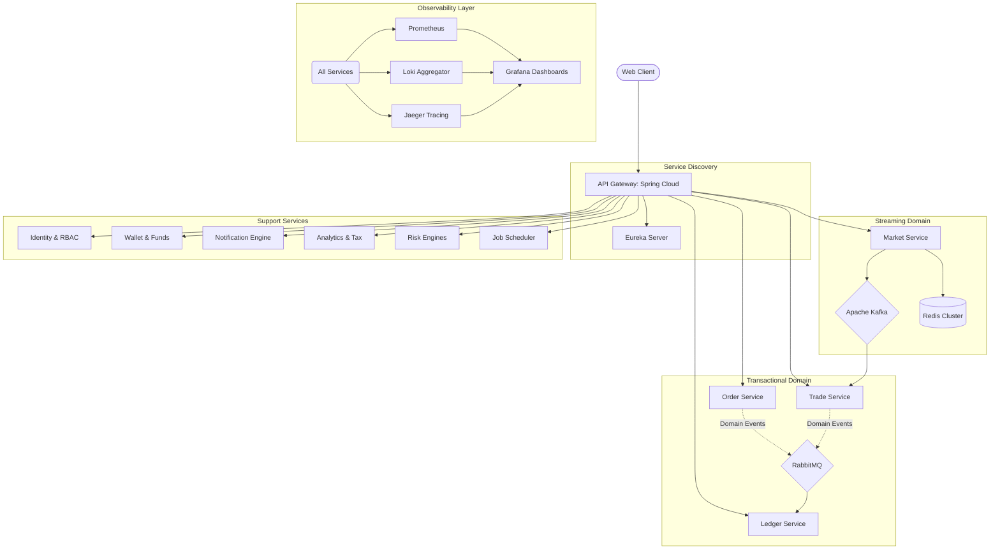

# 🏦 Winvestco: Institutional Grade Multi-Asset Trading Platform

[](https://www.oracle.com/java/technologies/javase/jdk21-archive-downloads.html)
[](https://spring.io/projects/spring-boot)
[](./docs/adr/0002-microservices-architecture.md)
[](https://opensource.org/licenses/MIT)

**Winvestco** is a high-performance, distributed trading engine designed to meet the rigorous demands of modern financial markets. Engineered with a **cloud-native microservices architecture**, it leverages the latest advancements in **Java 21**, including **Virtual Threads (Project Loom)**, to achieve unprecedented concurrency and throughput.

---

## 🏛 Technical Vision

The platform is built on five core architectural pillars:
1.  **Extreme Concurrency**: Optimized for millions of concurrent I/O operations using Virtual Threads.
2.  **Strict Auditability**: An immutable, double-entry ledger serves as the authoritative source of truth.
3.  **Event-Driven Resilience**: Asynchronous domain events decouple critical business logic across a dual-broker infrastructure.
4.  **Real-Time Streaming**: Low-latency market data delivery via gRPC and high-throughput Kafka pipelines.
5.  **Observability First**: Comprehensive PLG+J stack integration for zero-blindspot monitoring.

---

## 🏗 System Architecture

Winvestco utilizes a sophisticated distributed system composed of **14 specialized services**, each owning its domain and persistence layer.

### Core Ecosystem


---

## 🚀 Performance Benchmarks: Java 21 Virtual Threads

Operating on a standard platform hardware, Winvestco demonstrates massive scalability by offloading platform threads to lightweight virtual threads.

| Concurrent Tasks | Execution Time | Platform Thread Blocking | Speedup Factor |
| :--- | :--- | :--- | :--- |
| 5,000 | 2,262ms | 0% | 221x |
| 20,000 | 816ms | 0% | 1,225x |
| **50,000** | **1,354ms** | **0%** | **1,846x** |

> [!TIP]
> This performance is achieved without complex reactive programming (WebFlux), maintaining a straightforward, imperative programming model that is easier to debug and maintain.

---

## 🔍 Deep Dive: Key Components

<details>
<summary><b>1. Dual Message Broker Strategy (Kafka + RabbitMQ)</b></summary>
We separate high-throughput telemetry from high-reliability business events:
- **Apache Kafka**: Handles NSE India market data streaming, OHLC candle generation, and order-book snapshots.
- **RabbitMQ**: Manages 26+ distinct Domain Events (e.g., `OrderFilledEvent`, `FundsLockedEvent`) with guaranteed delivery and dead-letter routing.
</details>

<details>
<summary><b>2. Immutable Ledger Service</b></summary>
The system's financial integrity rests on the **Ledger Service**:
- **Double-Entry Accounting**: Every credit has a corresponding debit.
- **Append-Only Storage**: Financial records are never updated or deleted.
- **Authoritative Balance**: Wallet balances in `Funds-Service` are periodic snapshots; the Ledger is the ultimate truth for reconciliation.
</details>

<details>
<summary><b>3. Event-Driven Workflows & Domain Events</b></summary>
The platform orchestrates complex sequences using an event-driven model with **26 distinct Domain Events** across 6 categories:

#### 👤 User Events
- `UserCreatedEvent`, `UserUpdatedEvent`, `UserLoginEvent`
- `UserStatusChangedEvent`, `UserRoleChangedEvent`, `UserPasswordChangedEvent`

#### 📦 Order Events
- `OrderCreatedEvent`, `OrderValidatedEvent`, `OrderFilledEvent`
- `OrderCancelledEvent`, `OrderExpiredEvent`, `OrderRejectedEvent`

#### 💰 Funds Events
- `FundsDepositedEvent`, `FundsWithdrawnEvent`
- `FundsLockedEvent`, `FundsReleasedEvent`

#### 📈 Trade Events
- `TradeCreatedEvent`, `TradePlacedEvent`, `TradeExecutedEvent`
- `TradeClosedEvent`, `TradeCancelledEvent`, `TradeFailedEvent`

#### 💳 Payment Events
- `PaymentCreatedEvent`, `PaymentSuccessEvent`
- `PaymentFailedEvent`, `PaymentExpiredEvent`

#### 📊 Report Events
- `ReportRequestedEvent`, `ReportCompletedEvent`

**Workflow Example:**
1.  **Order Service** validates an order and emits `OrderCreatedEvent`.
2.  **Funds Service** consumes the event and emits `FundsLockedEvent`.
3.  **Trade Service** matches the order and emits `TradeExecutedEvent`.
4.  **Ledger Service** records entries and notifies **Notification Service**.
</details>

---

---

## 🎨 Frontend Application: Winvestco Terminal

The Winvestco Frontend is a modern, high-performance web terminal built for traders who demand speed and clarity. It provides a real-time, interactive environment for market analysis and execution.

### ✨ Key Interface Features
- **Advanced Charting**: Integrated **TradingView Lightweight Charts** for professional-grade technical analysis and real-time price action.
- **Dynamic Portfolio Dashboard**: Live tracking of holdings, realized/unrealized P&L, and asset allocation visualizations.
- **Institutional Order Management**: Comprehensive order entry system with support for Market, Limit, and Stop orders.
- **Real-time Ticker & Data**: Low-latency streaming of top-movers, indices, and watchlists via optimized WebSocket/Redis pipelines.
- **Financial Command Center**: Unified wallet management for instant deposits, withdrawals, and detailed transaction history.
- **Smart Notifications**: Multi-channel alert system featuring an in-app **Notification Bell** and proactive **Toast Overlays**.
- **Interactive Reports**: Deep-dive analytics, tax-ready transaction reports, and performance history.

### 💻 Frontend Tech Stack
- **Framework**: **React 19** for lightning-fast rendering and state management.
- **Build Engine**: **Vite 7** for near-instant hot module replacement (HMR).
- **Animations**: **Framer Motion** for premium micro-interactions and smooth layout transitions.
- **Data Visualization**: **Lightweight Charts** & **Lucide React** for crisp, intuitive data representation.
- **Routing**: **React Router Dom 7** for secure, multi-layered client-side navigation.
- **Testing**: **Vitest & React Testing Library** for 100% component reliability.

### 🏃 Running the Terminal
1.  Navigate to the directory: `cd frontend`
2.  Install dependencies: `npm install`
3.  Start development server: `npm run dev`
4.  Access the terminal at: `http://localhost:5173`

---

## 🛠 Detailed Technical Stack

### 🚀 Core Platform & Runtime
- **Java 21 LTS**: Utilizing **Virtual Threads** (Project Loom) for lightweight concurrency, **Pattern Matching**, and **Sequenced Collections** to write clean, high-performance code.
- **Spring Boot 3.2.x**: The backbone of our services, providing auto-configuration, robust dependency injection, and production-ready features.
- **Maven**: Multi-module project management for version consistency across services.

### 🌐 Microservices Orchestration
- **Spring Cloud 2023**: 
  - **API Gateway**: Centralized entry point with global filters for authentication, rate limiting, and request transformation.
  - **Eureka Server**: Netflix-based service discovery allowing dynamic scaling and load balancing.
  - **OpenFeign**: Declarative REST client for simplified inter-service communication.
- **Resilience4j**: Implementing **Circuit Breakers**, **Rate Limiters**, and **Retries** to prevent cascading failures in the distributed system.

### 💾 Data Persistence & Caching
- **PostgreSQL 16**: Primary relational engine for transactional data, utilizing **Flyway** for automated database migrations.
- **Redis 7**: Dual-purpose deployment:
  - **Caching**: Storing session data and frequent metadata.
  - **Streaming**: Delivering ultra-fast market data snapshots to frontend subscribers.
- **MapStruct**: High-performance, type-safe bean mapping between Entities and DTOs.

### 📡 Communication & Messaging
- **gRPC & Protocol Buffers**: Used for high-speed, binary internal streaming of Market Data from `Market-Service` to `Trade-Service`.
- **Apache Kafka**: High-throughput distributed log (KRaft mode) for market data ingestion and real-time candle (OHLC) generation.
- **RabbitMQ**: Message broker for mission-critical domain events using **Topic Exchanges** and **Dead Letter Queues (DLQ)**.

### 🧪 Quality Assurance
- **JUnit 5 & AssertJ**: Standardized unit testing with fluent assertions.
- **Mockito**: Mocking framework for isolated service testing.
- **Vitest & React Testing Library**: Modern component testing and snapshot verification for the frontend.
- **JaCoCo**: Automated code coverage reporting integrated into the build pipeline.

---

## 🌐 Network Port Reference

The platform requires the following ports to be available on the host machine for local development:

### Application Services
| Service | Port | Description |
| :--- | :--- | :--- |
| **API Gateway** | `8090` | Main entry point for all client requests |
| **Eureka Server** | `8761` | Service discovery dashboard |
| **User Service** | `8088` | Identity and RBAC management |
| **Market Service** | `8084` | Market data and gRPC streaming |
| **Portfolio Service** | `8086` | User holdings and P&L |
| **Funds Service** | `8085` | Wallet and balance management |
| **Ledger Service** | `8082` | Immutable financial ledger |
| **Order Service** | `8081` | Order lifecycle and matching logic |
| **Trade Service** | `8083` | Trade execution engine (Matching Engine) |
| **Notification Svc**| `8089` | Virtual-thread driven alerts |
| **Payment Service** | `8087` | Payment gateway integration |
| **Report Service** | `8091` | Async report generation |
| **Risk Service** | `8092` | Real-time risk management |
| **Schedule Service** | `8095` | Distributed job scheduling |
| **Frontend** | `5173` | React development server (Vite) |

### Infrastructure & Operations
| Component | Port | Interface |
| :--- | :--- | :--- |
| **PostgreSQL** | `5432` | Primary database |
| **Redis** | `6379` | Cache and streaming snapshots |
| **RabbitMQ** | `5672` | AMQP messaging protocol |
| **RabbitMQ UI** | `15672` | Management dashboard |
| **Kafka (KRaft)** | `9092` | Market data ingestion (Broadcasting) |
| **Grafana** | `3000` | Central observability dashboard |
| **Prometheus** | `9090` | Metrics engine dashboard |
| **Jaeger UI** | `16686` | Distributed tracing explorer |
| **Loki** | `3100` | Log aggregation endpoint |

---

## 📈 Observability & Monitoring

The system is instrumented for "Real-world Production" readiness:
- **Distributed Tracing**: Follow a single user request across services via Jaeger.
- **Log Aggregation**: Filter production logs by `service`, `traceID`, or `correlationID` in Loki.
- **System Metrics**: Real-time JVM, CPU, and Memory usage dashboards in Grafana.

| Tool | Default Port | Access URL |
| :--- | :--- | :--- |
| **Grafana** | 3000 | [http://localhost:3000](http://localhost:3000) (admin/winvestco) |
| **Prometheus** | 9090 | [http://localhost:9090](http://localhost:9090) |
| **Jaeger** | 16686 | [http://localhost:16686](http://localhost:16686) |
| **Eureka** | 8761 | [http://localhost:8761](http://localhost:8761) |

---

## 🏁 Development & Setup

### Requirements
- **JDK 21** (MANDATORY for Virtual Threads)
- **PowerShell 7+** (For setup scripts)
- **Node.js 20+**
- **Maven 3.9+**

### 🚀 One-Click Startup (Recommended for Windows)

We provide a comprehensive PowerShell automation script that handles infrastructure, service discovery, gateway, and all microservices in the correct order.

```powershell
cd backend
.\start-all.ps1
```

**What this does:**
1.  Checks and starts **Infrastructure** (Postgres, Redis, RabbitMQ, Kafka, Observability Stack) via `start-infra.ps1`.
2.  Starts **Eureka Server** and waits for health check.
3.  Starts **API Gateway** and waits for health check.
4.  Launches all **Backend Microservices** in parallel windows.

### 🐳 Docker Setup (Alternative)

If you prefer running infrastructure via Docker:

```bash
cd backend
docker-compose -f docker-compose-services.yml up -d
```

Then manually start the services:
```bash
./mvnw clean install
./mvnw spring-boot:run -pl api-gateway,eureka-server,user-service
# ... repeat for other services
```

### ☸️ Kubernetes Deployment (Production-Ready)

For production deployments, we provide comprehensive Kubernetes manifests with Kustomize support for environment-specific configurations.

#### Prerequisites
- Kubernetes cluster (v1.25+)
- kubectl configured
- Kustomize (v5.0+)
- NGINX Ingress Controller
- cert-manager (for TLS)

#### Quick Deploy

```bash
# Deploy to Development (1 replica per service)
kubectl apply -k k8s/overlays/dev/

# Deploy to Staging (2 replicas per service)
kubectl apply -k k8s/overlays/staging/

# Deploy to Production (3 replicas, high resources)
kubectl apply -k k8s/overlays/production/
```

#### Kubernetes Architecture

| Component | Type | Purpose |
|-----------|------|---------|
| **PostgreSQL** | StatefulSet | Primary database with persistence |
| **Redis** | Deployment | Distributed cache & session store |
| **RabbitMQ** | Deployment | Message broker with management UI |
| **Kafka + Zookeeper** | Deployment | Event streaming platform |
| **14 Microservices** | Deployment | Spring Boot services with HPA ready |
| **Prometheus** | Deployment | Metrics collection |
| **Grafana** | Deployment | Visualization dashboards |
| **Jaeger** | Deployment | Distributed tracing |
| **Loki** | Deployment | Log aggregation |

#### Features

- **Kustomize Overlays**: Environment-specific configs (dev/staging/prod)
- **Health Checks**: Liveness and readiness probes on all services
- **Resource Limits**: CPU/memory requests and limits defined
- **ConfigMaps & Secrets**: Centralized configuration management
- **Persistent Volumes**: Data persistence for databases
- **Ingress**: NGINX ingress with TLS support
- **Observability**: Full PLG+J stack integrated

See [k8s/README.md](./k8s/README.md) for detailed deployment guide.

---

## 📂 Documentation Inventory
- **[ADR Catalog](./docs/adr/)**: Comprehensive list of Architectural Decision Records.
- **[Observability Guide](./docs/observability-guide.md)**: Deep dive into monitoring setup.
- **[Project Context](./context/)**: Domain-specific improvement plans and roadmaps.

---

## 📄 License
This platform is released under the **MIT License**. See `LICENSE` for the full text.

---
*Built with ❤️ by Me & My Agents*
