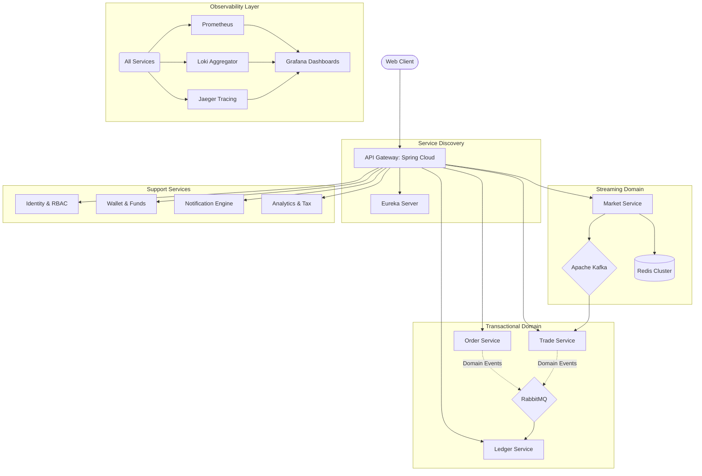

# 🏦 Winvestco: Institutional Grade Multi-Asset Trading Platform

[](https://www.oracle.com/java/technologies/javase/jdk21-archive-downloads.html)
[](https://spring.io/projects/spring-boot)
[](./docs/adr/0002-microservices-architecture.md)
[](https://opensource.org/licenses/MIT)

**Winvestco** is a high-performance, distributed trading engine designed to meet the rigorous demands of modern financial markets. Engineered with a **cloud-native microservices architecture**, it leverages the latest advancements in **Java 21**, including **Virtual Threads (Project Loom)**, to achieve unprecedented concurrency and throughput.

---

## 🏛 Technical Vision

The platform is built on five core architectural pillars:
1.  **Extreme Concurrency**: Optimized for millions of concurrent I/O operations using Virtual Threads.
2.  **Strict Auditability**: An immutable, double-entry ledger serves as the authoritative source of truth.
3.  **Event-Driven Resilience**: Asynchronous domain events decouple critical business logic across a dual-broker infrastructure.
4.  **Real-Time Streaming**: Low-latency market data delivery via gRPC and high-throughput Kafka pipelines.
5.  **Observability First**: Comprehensive PLG+J stack integration for zero-blindspot monitoring.

---

## 🏗 System Architecture

Winvestco utilizes a sophisticated distributed system composed of 12 specialized services, each owning its domain and persistence layer.

### Core Ecosystem


---

## 🚀 Performance Benchmarks: Java 21 Virtual Threads

Operating on a standard platform hardware, Winvestco demonstrates massive scalability by offloading platform threads to lightweight virtual threads.

| Concurrent Tasks | Execution Time | Platform Thread Blocking | Speedup Factor |
| :--- | :--- | :--- | :--- |
| 5,000 | 2,262ms | 0% | 221x |
| 20,000 | 816ms | 0% | 1,225x |
| **50,000** | **1,354ms** | **0%** | **1,846x** |

> [!TIP]
> This performance is achieved without complex reactive programming (WebFlux), maintaining a straightforward, imperative programming model that is easier to debug and maintain.

---

## 🔍 Deep Dive: Key Components

<details>
<summary><b>1. Dual Message Broker Strategy (Kafka + RabbitMQ)</b></summary>
We separate high-throughput telemetry from high-reliability business events:
- **Apache Kafka**: Handles NSE India market data streaming, OHLC candle generation, and order-book snapshots.
- **RabbitMQ**: Manages 26+ distinct Domain Events (e.g., `OrderFilledEvent`, `FundsLockedEvent`) with guaranteed delivery and dead-letter routing.
</details>

<details>
<summary><b>2. Immutable Ledger Service</b></summary>
The system's financial integrity rests on the **Ledger Service**:
- **Double-Entry Accounting**: Every credit has a corresponding debit.
- **Append-Only Storage**: Financial records are never updated or deleted.
- **Authoritative Balance**: Wallet balances in `Funds-Service` are periodic snapshots; the Ledger is the ultimate truth for reconciliation.
</details>

<details>
<summary><b>3. Event-Driven Workflows</b></summary>
The platform orchestrates complex sequences using an event-driven model:
1.  **User Service** triggers `UserLoginEvent`.
2.  **Order Service** validates against `Funds Service` (Funds Locked).
3.  **Trade Service** matches orders and emits `TradeExecutedEvent`.
4.  **Ledger Service** records entries and notifies **Notification Service**.
</details>

---

## 🛠 Technology Stack

| Layer | Technologies |
| :--- | :--- |
| **Language** | Java 21 LTS, TypeScript (Frontend) |
| **Frameworks** | Spring Boot 3.4.x, Spring Cloud, Vite + React |
| **Infrastructure** | Docker, Docker Compose, Eureka Discovery |
| **Communication** | gRPC (Market Data), REST (Admin API), WebSocket (Push) |
| **Persistence** | PostgreSQL 16 (Relational), Redis 7 (Caching & Streaming) |
| **Messaging** | Apache Kafka (High Throughput), RabbitMQ (Reliability) |
| **Monitoring** | Prometheus, Grafana, Loki, Jaeger, Micrometer Tracing |

---

## 📈 Observability & Monitoring

The system is instrumented for "Real-world Production" readiness:
- **Distributed Tracing**: Follow a single user request across 12 services via Jaeger.
- **Log Aggregation**: Filter production logs by `service`, `traceID`, or `correlationID` in Loki.
- **System Metrics**: Real-time JVM, CPU, and Memory usage dashboards in Grafana.

| Tool | Default Port | Access URL |
| :--- | :--- | :--- |
| **Grafana** | 3000 | [http://localhost:3000](http://localhost:3000) |
| **Prometheus** | 9090 | [http://localhost:9090](http://localhost:9090) |
| **Jaeger** | 16686 | [http://localhost:16686](http://localhost:16686) |
| **Eureka** | 8761 | [http://localhost:8761](http://localhost:8761) |

---

## 🏁 Development & Setup

### Requirements
- **JDK 21** (MANDATORY for Virtual Threads)
- **PowerShell 7+** (For setup scripts)
- **Node.js 20+**
- **Docker Desktop**

### Setup Sequence
1.  **Infrastructure Initialization**:
    ```powershell
    cd backend
    .\start-infra.ps1
    ```
    *This runs localized PostgreSQL, Redis, RabbitMQ, and Kafka instances.*

2.  **Monitoring Stack**:
    ```bash
    docker-compose -f observability/docker-compose.yml up -d
    ```

3.  **Bootstrapping Services**:
    ```bash
    ./mvnw clean install
    ./mvnw spring-boot:run -pl api-gateway,eureka-server,user-service
    ```

---

## 📂 Documentation Inventory
- **[ADR Catalog](./docs/adr/)**: Comprehensive list of 11+ Architectural Decision Records.
- **[Observability Guide](./docs/observability-guide.md)**: Deep dive into monitoring setup.
- **[Project Context](./context/)**: Domain-specific improvement plans and roadmaps.

---

## 📄 License
This platform is released under the **MIT License**. See `LICENSE` for the full text.

---
*Built with ❤️ by the Winvestco Engineering Team.*
