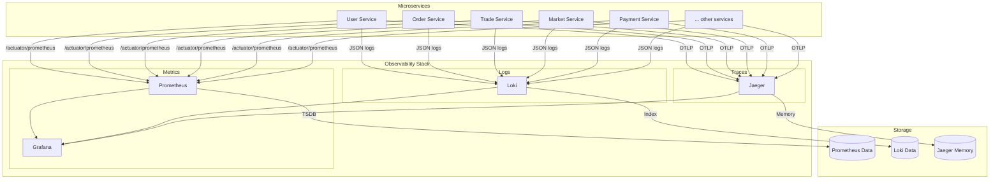

# 📊 Observability Stack Guide

[](http://localhost:3000)
[](http://localhost:9090)
[](http://localhost:16686)
[](http://localhost:3100)

The Winvestco Trading Platform implements a comprehensive **PLG+J Stack** (Prometheus, Loki, Grafana, and Jaeger) to provide full visibility into our microservices architecture. This observability stack ensures zero-blindspot monitoring across all system components.

---

## 🚀 Quick Access URLs

When running the stack via `docker-compose up -d`, you can access the following dashboards:

| Tool | Port | URL | Credentials | Description |
|------|------|-----|-------------|-------------|
| **Grafana** | 3000 | [http://localhost:3000](http://localhost:3000) | Admin/winvestco | Central visualization and dashboards |
| **Prometheus**| 9090 | [http://localhost:9090](http://localhost:9090) | - | Raw metrics collection and alerting rules |
| **Jaeger** | 16686| [http://localhost:16686](http://localhost:16686) | - | Distributed tracing UI |
| **Loki** | 3100 | [http://localhost:3100](http://localhost:3100) | - | Log aggregation query interface |
| **Eureka** | 8761 | [http://localhost:8761](http://localhost:8761) | - | Service discovery status |

---

## 🏗 Architecture Overview



---

## 📈 1. Metrics (Prometheus & Grafana)

### Implementation Details

Each microservice is equipped with **Spring Boot Actuator** and **Micrometer**, exposing metrics at `/actuator/prometheus`.

**Key Metrics Collected:**
- **JVM Metrics**: Memory usage, GC pauses, thread pools
- **HTTP Metrics**: Request count, response time, error rates
- **Database Metrics**: Connection pool usage, query performance
- **Custom Business Metrics**: Order counts, trade volumes, user activity

### Configuration

**Dependencies** (in `common/pom.xml`):
```xml
<dependency>
    <groupId>io.micrometer</groupId>
    <artifactId>micrometer-registry-prometheus</artifactId>
</dependency>
```

**Service Configuration** (example):
```yaml
management:
  endpoints:
    web:
      exposure:
        include: health,info,prometheus
  metrics:
    export:
      prometheus:
        enabled: true
```

### How to Use

1. **Open Grafana** at [http://localhost:3000](http://localhost:3000)
2. Navigate to **Dashboards** > **Browse**
3. Choose from available dashboards:
   - `Spring Boot Statistics` - Application performance
   - `JVM Micrometer` - Runtime metrics
   - `Platform Overview` - System-wide view
4. Filter by `service` or `instance` to see specific metrics
5. Use time range selector to analyze trends

### Key Dashboards

- **Platform Overview**: System-wide health and performance
- **Service Performance**: Individual service metrics
- **Database Performance**: Connection pool and query metrics
- **Business Metrics**: Trading volumes, user activity

---

## 📝 2. Log Aggregation (Loki)

### Implementation Details

Logs are aggregated using **Loki4j** and **Logback**, formatted as structured JSON, and pushed to Loki for centralized querying.

**Log Format:**
```json
{
  "timestamp": "2024-01-15T10:30:45.123Z",
  "level": "INFO",
  "service": "order-service",
  "traceId": "a1b2c3d4e5f6g7h8",
  "spanId": "i1j2k3l4m5n6",
  "message": "Order created successfully",
  "userId": "user123",
  "orderId": "order456"
}
```

### Configuration

**Dependencies**:
```xml
<dependency>
    <groupId>com.github.loki4j</groupId>
    <artifactId>loki-logback-appender</artifactId>
    <version>1.5.1</version>
</dependency>
<dependency>
    <groupId>net.logstash.logback</groupId>
    <artifactId>logstash-logback-encoder</artifactId>
    <version>7.4</version>
</dependency>
```

**Logback Configuration** (`logback-spring.xml`):
```xml
<appender name="LOKI" class="com.github.loki4j.logback.Loki4jAppender">
    <http>
        <url>http://loki:3100/loki/api/v1/push</url>
    </http>
    <format>
        <label>
            <pattern>service=${spring.application.name},traceId=${mdc.traceId}</pattern>
        </label>
        <message>
            <json>
                <timestamp>@timestamp</timestamp>
                <level>level</level>
                <thread>thread</thread>
                <logger>logger</logger>
                <message>message</message>
                <mdc>mdc</mdc>
            </json>
        </message>
    </format>
</appender>
```

### How to Use

1. **Open Grafana** and go to **Explore** (compass icon)
2. Select **Loki** as the Data Source
3. Use the **Label Browser** to filter by `service`:
   - Example: `{service="order-service"}`
4. Click **Run Query** to view live logs
5. **Advanced Features**:
   - Search by keywords: `error OR exception`
   - Filter by trace ID: `{traceId="a1b2c3d4e5f6g7h8"}`
   - Time-based filtering: `>5m` (last 5 minutes)

### Log Correlation

- **Trace IDs**: Automatically included in logs for correlation
- **Service Context**: Each log entry includes service name
- **Structured Data**: JSON format enables powerful querying

---

## 🕵️ 3. Distributed Tracing (Jaeger)

### Implementation Details

Distributed tracing tracks a single user request as it travels through multiple services (e.g., from `API Gateway` → `Order Service` → `Funds Service` → `Payment Service`).

**Technology Stack:**
- **OpenTelemetry**: Standard for trace generation
- **Jaeger**: Trace collection and visualization
- **OTLP Protocol**: Modern trace transport

### Configuration

**Dependencies**:
```xml
<dependency>
    <groupId>io.micrometer</groupId>
    <artifactId>micrometer-tracing-bridge-otel</artifactId>
</dependency>
<dependency>
    <groupId>io.opentelemetry</groupId>
    <artifactId>opentelemetry-exporter-otlp</artifactId>
</dependency>
```

**Service Configuration**:
```yaml
management:
  otlp:
    tracing:
      endpoint: http://jaeger:4318/v1/traces
```

**Environment Variables**:
```yaml
OTEL_EXPORTER_OTLP_ENDPOINT=http://jaeger:4318/v1/traces
OTEL_SERVICE_NAME=order-service
OTEL_TRACES_SAMPLER=parentbased_traceidratio
OTEL_TRACES_SAMPLER_ARG=1.0
```

### Custom Tracing

**OpenTelemetryConfig** provides utilities:
```java
// Get current trace context
String traceId = OpenTelemetryConfig.getCurrentTraceId();
String spanId = OpenTelemetryConfig.getCurrentSpanId();

// Create custom spans
@Autowired
private Tracer tracer;

Span customSpan = tracer.spanBuilder("custom-operation")
    .setAttribute("userId", userId)
    .setAttribute("operation", "processPayment")
    .startSpan();
```

### How to Use

1. **Open Jaeger UI** at [http://localhost:16686](http://localhost:16686)
2. **Select Service** from dropdown (e.g., `api-gateway`)
3. **Click "Find Traces"** to see recent requests
4. **Click on a trace** to see detailed timeline:
   - Service call sequence
   - Latency breakdown
   - Error indicators
   - Tags and metadata
5. **Search Features**:
   - By trace ID: `a1b2c3d4e5f6g7h8`
   - By duration: `>100ms`
   - By tags: `userId=user123`

### Trace Sampling

- **Current Configuration**: 100% sampling (`OTEL_TRACES_SAMPLER_ARG=1.0`)
- **Production Recommendation**: Adjust to 1-10% for high-traffic systems
- **Adaptive Sampling**: Consider for complex workflows

---

## 🔧 4. Adding Observability to New Services

When creating a new microservice, follow these steps:

### Step 1: Add Dependencies

In your service's `pom.xml`:
```xml
<dependency>
    <groupId>in.winvestco</groupId>
    <artifactId>common</artifactId>
    <version>1.0.0</version>
</dependency>
```

The common module includes all necessary observability dependencies.

### Step 2: Configure Management Endpoints

In `application.yml`:
```yaml
management:
  endpoints:
    web:
      exposure:
        include: health,info,prometheus
  otlp:
    tracing:
      endpoint: http://jaeger:4318/v1/traces
  metrics:
    export:
      prometheus:
        enabled: true
```

### Step 3: Add Prometheus Scrape Configuration

Update `observability/prometheus/prometheus.yml`:
```yaml
scrape_configs:
  - job_name: 'new-service'
    metrics_path: '/actuator/prometheus'
    static_configs:
      - targets: ['new-service:8080']
        labels:
          service: 'new-service'
```

### Step 4: Docker Compose Configuration

Add to `docker-compose.yml`:
```yaml
new-service:
  # ... other configuration
  environment:
    - OTEL_EXPORTER_OTLP_ENDPOINT=http://jaeger:4318/v1/traces
    - OTEL_SERVICE_NAME=new-service
    - OTEL_TRACES_SAMPLER=parentbased_traceidratio
    - OTEL_TRACES_SAMPLER_ARG=1.0
```

### Step 5: Custom Metrics (Optional)

```java
@Component
public class CustomMetrics {
    private final Counter orderCounter;
    private final Timer orderProcessingTimer;
    
    public CustomMetrics(MeterRegistry meterRegistry) {
        this.orderCounter = Counter.builder("orders.created")
            .description("Total orders created")
            .register(meterRegistry);
        this.orderProcessingTimer = Timer.builder("order.processing.time")
            .description("Order processing time")
            .register(meterRegistry);
    }
    
    public void recordOrderCreated() {
        orderCounter.increment();
    }
    
    public void recordProcessingTime(Duration duration) {
        orderProcessingTimer.record(duration);
    }
}
```

---

## 🚨 5. Alerting and Monitoring

### Prometheus Alerting Rules

**Key Alerts Configured**:
- **Service Down**: Service unreachable for >1min
- **High Error Rate**: >5% error rate for >5min
- **High Latency**: P95 latency >1s for >5min
- **Memory Usage**: >80% heap usage
- **GC Pressure**: High GC pause times

**Alert Rules Location**: `observability/prometheus/alerts.yml`

### Grafana Alerting

- **Dashboard Alerts**: Visual alerts on dashboards
- **Notification Channels**: Email, Slack (configurable)
- **Alert Thresholds**: Customizable per service

---

## 📊 6. Performance Optimization

### Metrics Optimization

- **Cardinality Reduction**: Avoid high-cardinality labels
- **Sampling Strategy**: Adjust sampling rates for high-traffic services
- **Retention Policies**: Configure data retention based on storage constraints

### Logging Optimization

- **Log Levels**: Use appropriate log levels (INFO/WARN/ERROR)
- **Structured Logging**: Include relevant context in log entries
- **Log Sampling**: Consider sampling for verbose logs

### Tracing Optimization

- **Span Limits**: Configure maximum span attributes
- **Sampling**: Implement intelligent sampling strategies
- **Batch Processing**: Use batch exporters for better performance

---

## 🔍 7. Troubleshooting Guide

### Common Issues

**Service Not Appearing in Prometheus**:
1. Check service is running and healthy
2. Verify `/actuator/prometheus` endpoint is accessible
3. Check Prometheus configuration
4. Review network connectivity

**Missing Logs in Loki**:
1. Verify Loki appender configuration
2. Check log levels
3. Review network connectivity to Loki
4. Check Loki storage status

**No Traces in Jaeger**:
1. Verify OTLP endpoint configuration
2. Check sampling configuration
3. Review OpenTelemetry dependencies
4. Check Jaeger collector status

### Debug Commands

```bash
# Check service health
curl http://localhost:8088/actuator/health

# Verify metrics endpoint
curl http://localhost:8088/actuator/prometheus

# Check Prometheus targets
curl http://localhost:9090/api/v1/targets

# Test Loki query
curl -G -s "http://localhost:3100/loki/api/v1/query" --data-urlencode 'query={service="user-service"}'

# Check Jaeger services
curl http://localhost:16686/api/services
```

---

## 📚 8. Best Practices

### Metrics Best Practices

1. **Use Meaningful Names**: Descriptive metric names
2. **Add Labels**: Contextual information (service, environment)
3. **Avoid High Cardinality**: Limit unique label values
4. **Document Metrics**: Include descriptions and units

### Logging Best Practices

1. **Structured Logs**: Use JSON format consistently
2. **Include Context**: Add trace IDs, user IDs, request IDs
3. **Appropriate Levels**: Use correct log severity levels
4. **Avoid Sensitive Data**: Don't log passwords, tokens

### Tracing Best Practices

1. **Meaningful Span Names**: Descriptive operation names
2. **Relevant Attributes**: Add business context to spans
3. **Proper Sampling**: Balance visibility vs. performance
4. **Error Handling**: Mark error spans appropriately

---

## 🔮 9. Future Enhancements

### Planned Improvements

- **Service Mesh Integration**: Istio + Jaeger integration
- **Advanced Alerting**: Machine learning-based anomaly detection
- **Log Analytics**: Advanced log parsing and analysis
- **Custom Dashboards**: Business-focused monitoring dashboards
- **APM Integration**: External APM tool integration

### Scalability Considerations

- **Horizontal Scaling**: Multiple Prometheus instances
- **Long-term Storage**: Configure external storage for metrics
- **Federation**: Cross-cluster metrics federation
- **Disaster Recovery**: Backup and recovery strategies

---

## 📖 10. Additional Resources

### Documentation

- [Prometheus Documentation](https://prometheus.io/docs/)
- [Grafana Documentation](https://grafana.com/docs/)
- [Jaeger Documentation](https://www.jaegertracing.io/docs/)
- [Loki Documentation](https://grafana.com/docs/loki/latest/)
- [OpenTelemetry Documentation](https://opentelemetry.io/docs/)

### Community

- [Grafana Community](https://community.grafana.com/)
- [Prometheus Users](https://prometheus.io/community/)
- [Jaeger Slack](https://jaegertracing.io/slack/)
- [OpenTelemetry Community](https://opentelemetry.io/community/)

### Training

- [Observability Fundamentals](https://prometheus.io/docs/introduction/overview/)
- [Distributed Tracing Guide](https://opentelemetry.io/docs/concepts/signals/traces/)
- [Grafana Dashboard Tutorial](https://grafana.com/tutorials/)

---

## 🤝 Contributing to Observability

When adding new features or services:

1. **Include Observability**: Add metrics, logs, and traces
2. **Update Documentation**: Keep this guide current
3. **Test Monitoring**: Verify observability works correctly
4. **Review Dashboards**: Update dashboards as needed

For questions or issues with the observability stack:
- Check the troubleshooting section
- Review service logs
- Consult the official documentation
- Reach out to the platform team

---

**Last Updated**: January 2024  
**Version**: 1.0.0  
**Maintainers**: Winvestco Platform Team
